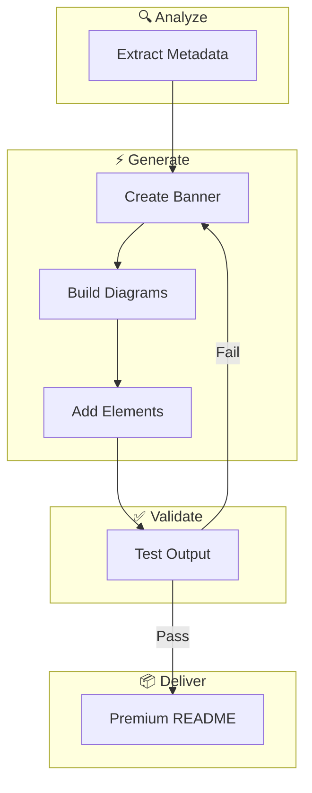
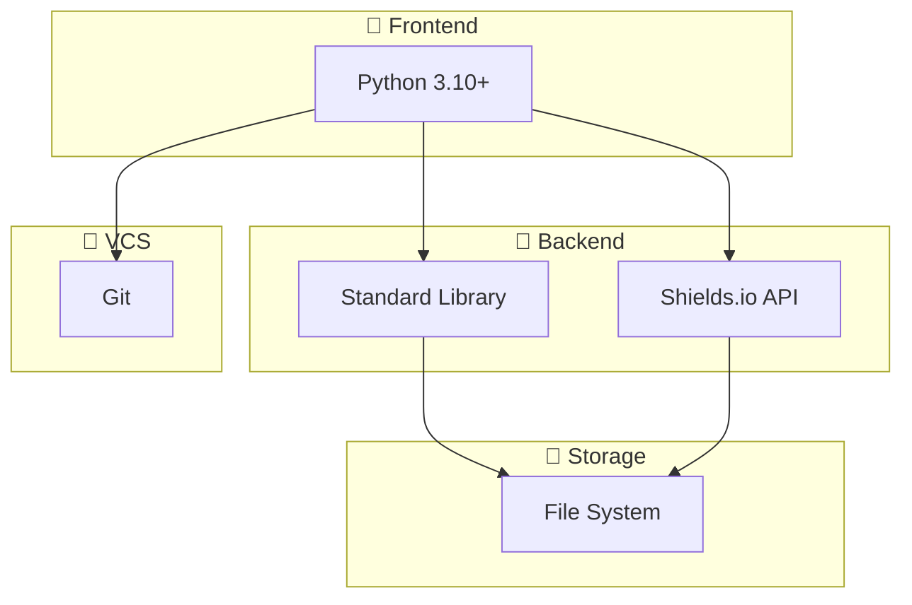

# 🎨 GitHub README Crafter

<div align="center">
  <picture>
    <source media="(prefers-color-scheme: light)" srcset="assets/banner-light.svg">
    
  </picture>
</div>

<div align="center">

### English | [中文](README.zh-CN.md)

</div>

<p align="center">


</p>

> **Transform your project documentation from invisible to irresistible.**
> AI-powered generation with Spec-Driven Development ensures every README is a premium first impression.

## ✨ Features

| Feature | Description |
|---------|-------------|
| 🎨 **Dynamic Banners** | SVG banners with gradient backgrounds and geometric decorations |
| 📊 **Mermaid Diagrams** | Auto-generated tech stack and architecture visualizations |
| 🌐 **Bilingual** | English and Chinese, structurally identical |
| 🌓 **Dark/Light Mode** | Theme-aware assets that adapt automatically |
| ⚡ **TL;DR Quick Start** | One command to immediate productivity |
| 📈 **Star History** | Interactive project growth visualization |
| 👥 **Contributors** | Automatic contributor showcase |
| 📢 **Share Buttons** | Reddit, Hacker News, Twitter, LinkedIn |

## 🚀 Quick Start

```bash
# Clone the skill
git clone https://github.com/AlanSong2077/github-readme-crafter-Skill.git
cd github-readme-crafter-Skill

# Generate premium README
python3 scripts/create_readme.py /path/to/project --style professional

# Validate (REQUIRED)
python3 test.py /path/to/project
```

**Requirements**: Python 3.10+

## 🔧 How It Works



## 📐 Tech Stack



## 📁 Project Structure

```
github-readme-crafter-Skill/
├── SPEC.md                    # Specification (source of truth)
├── Agent.md                  # Agent operating instructions
├── test.md                   # Validation test definitions
├── test.py                   # Executable validator
├── scripts/
│   ├── create_readme.py      # Main generator
│   ├── analyze_project.py     # Project analyzer
│   ├── generate_banner.py     # SVG banner generator
│   ├── generate_mermaid.py     # Diagram generator
│   └── generate_advanced_elements.py
└── references/
    ├── templates.md           # README templates
    ├── top_projects_analysis.md
    └── mermaid_examples.md
```

## 🎯 Style Tiers

| Tier | Description |
|------|-------------|
| `standard` | All premium sections included |
| `professional` | + Sponsors, extended architecture, security |

Both tiers produce visually stunning documentation. Every README is a masterpiece.

## 🛡️ Validation

Every output passes **7 categories of hard validation tests**:

| Category | Tests | Failure |
|----------|-------|---------|
| A - Structural | Files, dimensions | HARD |
| B - Content | TL;DR, sections | HARD |
| C - Badges | Count, style, URLs | HARD |
| D - Images | Accessibility | HARD |
| E - Mermaid | Syntax validity | HARD |
| F - Bilingual | Parity check | HARD |

```bash
# Validate your README
python3 test.py /path/to/project
```

## 📊 Star History

[](https://www.star-history.com/#AlanSong2077/github-readme-crafter-Skill&type=Date)

## 👥 Contributors

<a href="https://github.com/AlanSong2077/github-readme-crafter-Skill/graphs/contributors">
  
</a>

## 🔗 Share

[](https://reddit.com/submit?url=https://github.com/AlanSong2077/github-readme-crafter-Skill&title=GitHub%20README%20Crafter%20-%20AI-Powered%20Premium%20Documentation)
[](https://news.ycombinator.com/submitlink?u=https://github.com/AlanSong2077/github-readme-crafter-Skill)
[](https://twitter.com/share?url=https://github.com/AlanSong2077/github-readme-crafter-Skill&text=GitHub%20README%20Crafter%20-%20AI-Powered%20Premium%20Documentation)
[](https://www.linkedin.com/shareArticle?mini=true&url=https://github.com/AlanSong2077/github-readme-crafter-Skill&title=GitHub%20README%20Crafter)

## 🤝 Contributing

Contributions follow **Spec-Driven Development**:

1. Read `SPEC.md` before making changes
2. Update `SPEC.md` if adding new requirements
3. Update `test.md` with corresponding validation
4. Run `python3 test.py` to verify

## 📄 License

MIT License

---

<p align="center">

**Made with ❤️ by AlanSong2077**

</p>
