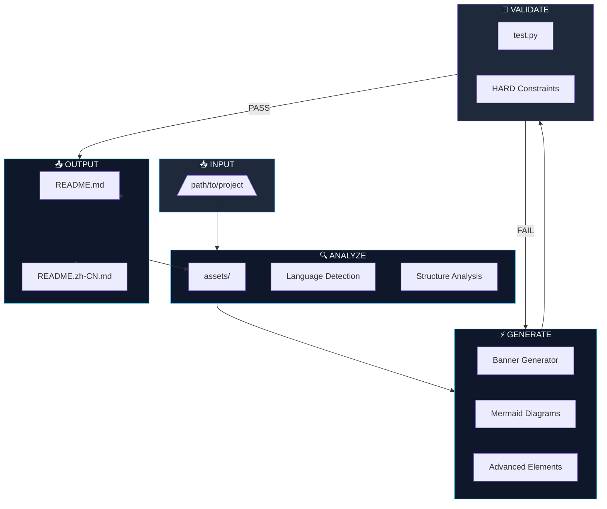
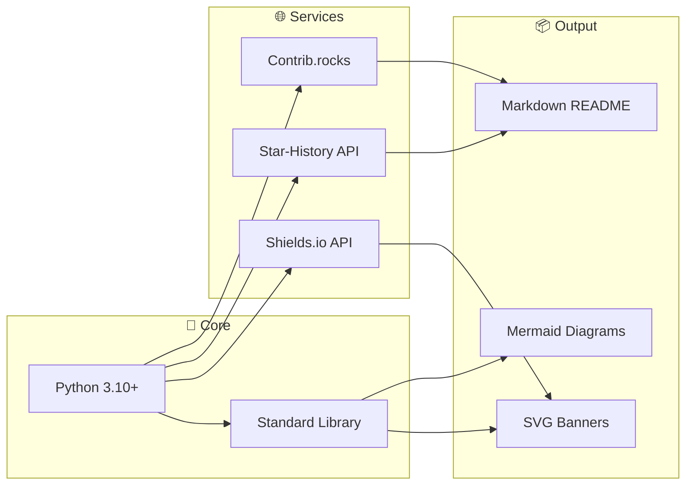

# 🎨 GitHub README Crafter

<p align="center">
  <a href="https://github.com/AlanSong2077/github-readme-crafter-Skill">
    
  </a>
</p>

<p align="center">
  <a href="https://github.com/AlanSong2077/github-readme-crafter-Skill/stargazers">
    
  </a>
  <a href="https://github.com/AlanSong2077/github-readme-crafter-Skill/forks">
    
  </a>
  
  
</p>

<p align="center">
  
  
  
  
</p>

<p align="center">
  <a href="https://github.com/AlanSong2077/github-readme-crafter-Skill/releases/latest">
    
  </a>
  
  
</p>

<div align="center">

### English | [中文](README.zh-CN.md)

</div>

---

## ✨ What is This?

<p align="center">
  <em>"Every README is a first impression. Make yours unforgettable."</em>
</p>

`github-readme-crafter` transforms ordinary project documentation into **premium, attention-grabbing** README documents using **Spec-Driven Development (SDD)** and **Harness Engineering**.

| Metric | Value |
|--------|-------|
| 📦 Scripts | 5 core generators |
| 📋 Sections | 14 premium sections |
| ✅ Validation | 7 test categories |
| 🌐 Languages | EN + 中文 |
| 🎨 Styles | 2 premium tiers |

---

## 🚀 Quick Start

```bash
# One-liner to glory
git clone https://github.com/AlanSong2077/github-readme-crafter-Skill.git \
  && cd github-readme-crafter-Skill \
  && python3 scripts/create_readme.py /path/to/project --style professional
```

```bash
# Full validation (REQUIRED before delivery)
python3 test.py /path/to/project
```

**Requires**: Python 3.10+

---

## ⚡ Features

| | Feature | Description |
|---|---------|-------------|
| 🎨 | **Dynamic Banners** | SVG with gradient + geometric decorations, dark/light mode |
| 📊 | **Mermaid Diagrams** | Tech stack, architecture, workflow — auto-generated |
| 🌓 | **Theme-Aware** | Automatic dark/light mode adaptation |
| ⚡ | **TL;DR Sections** | One-command quick start for busy readers |
| 📈 | **Star History** | Interactive project growth visualization |
| 🧪 | **Strong Validation** | 7 categories of HARD constraints, zero tolerance |
| 🌐 | **Bilingual** | English + Chinese, structurally identical |
| 🔒 | **Spec-First** | Specification-driven, no deviation allowed |

---

## 🔬 Architecture



---

## 📐 Tech Stack



---

## 📂 Project Structure

```
github-readme-crafter-Skill/
├── SPEC.md                    # 📜 Specification (source of truth)
├── Agent.md                  # 🤖 Agent instructions
├── test.md                   # 🧪 Test definitions
├── test.py                   # ⚡ Executable validator
│
├── scripts/
│   ├── create_readme.py      # 🚀 Main generator
│   ├── analyze_project.py     # 🔍 Project analyzer
│   ├── generate_banner.py     # 🎨 Banner generator
│   ├── generate_mermaid.py    # 📊 Diagram generator
│   └── generate_advanced_elements.py  # ✨ Badges & more
│
└── references/
    ├── templates.md           # 📋 README templates
    ├── top_projects_analysis.md  # 🏆 Top repo analysis
    └── mermaid_examples.md   # 📈 Diagram examples
```

---

## 🎯 Style Tiers

| Tier | Description | Use Case |
|------|-------------|----------|
| `standard` | All 14 premium sections | Medium projects |
| `professional` | Extended + sponsors, security | Large frameworks |

**Both tiers produce museum-quality documentation.**

---

## 🧪 Validation Pipeline

Every output must pass **ALL 7 categories**:

| Category | Checks | Enforcement |
|----------|--------|-------------|
| **A** | File existence, SVG validity, dimensions | HARD FAIL |
| **B** | TL;DR required, sections complete | HARD FAIL |
| **C** | ≤5 badges, flat-square, no emoji | HARD FAIL |
| **D** | URLs accessible (HTTP 200) | HARD FAIL |
| **E** | Valid Mermaid, ≤15 nodes | HARD FAIL |
| **F** | Bilingual parity, Chinese content | HARD FAIL |

```bash
# Validate your README
python3 test.py /path/to/project

# Exit code 0 = PASS, Exit code 1 = FAIL
```

---

## 📊 Project Stats

| Stat | Badge |
|------|-------|
| Stars |  |
| Forks |  |
| Size |  |

---

## 📈 Star History

[](https://www.star-history.com/#AlanSong2077/github-readme-crafter-Skill&type=Date)

---

## 👥 Contributors

<a href="https://github.com/AlanSong2077/github-readme-crafter-Skill/graphs/contributors">
  
</a>

---

## 🔗 Share the Love

<a href="https://github.com/AlanSong2077/github-readme-crafter-Skill">
  
</a>
<a href="https://reddit.com/submit?url=https://github.com/AlanSong2077/github-readme-crafter-Skill&title=GitHub%20README%20Crafter%20-%20Spec-Driven%20AI%20Documentation">
  
</a>
<a href="https://twitter.com/intent/tweet?url=https://github.com/AlanSong2077/github-readme-crafter-Skill&text=GitHub%20README%20Crafter%20-%20Spec-Driven%20AI%20Documentation%20Generator">
  
</a>
<a href="https://news.ycombinator.com/submitlink?u=https://github.com/AlanSong2077/github-readme-crafter-Skill">
  
</a>

---

## 🤝 Contributing

We follow **Spec-Driven Development**:

1. Read `SPEC.md` — source of truth
2. Make changes
3. Update `test.py` if needed
4. Run `python3 test.py` to verify
5. Submit PR

---

## 📜 License

MIT License

---

<p align="center">
  
  
</p>

<p align="center">
  <a href="https://github.com/AlanSong2077">@AlanSong2077</a> • 2026
</p>
