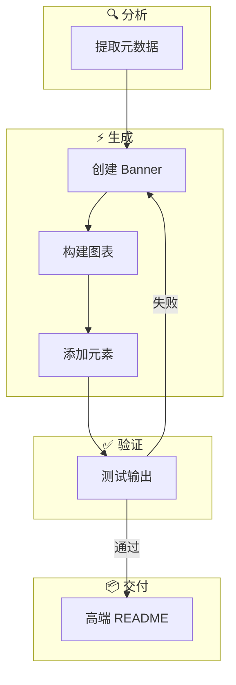
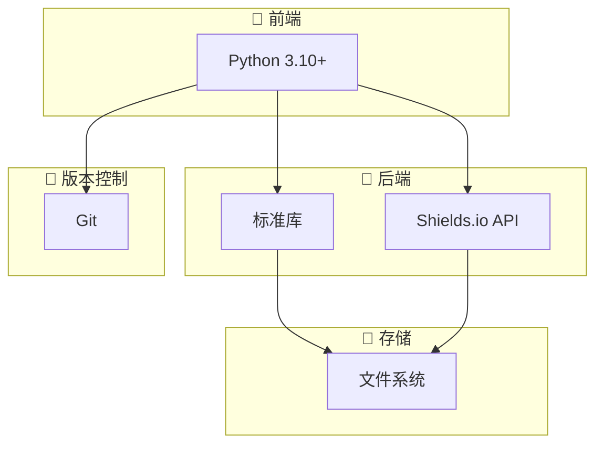

# 🎨 GitHub README Crafter

<div align="center">
  <picture>
    <source media="(prefers-color-scheme: light)" srcset="assets/banner-light.svg">
    
  </picture>
</div>

<div align="center">

### [English](README.md) | 中文

</div>

<p align="center">


</p>

> **让您的项目文档从默默无闻到引人注目。**
> AI 驱动的生成器配合规范驱动开发，确保每个 README 都是高端的第一印象。

## ✨ 特性

| 特性 | 描述 |
|------|------|
| 🎨 **动态 Banner** | 带渐变背景和几何装饰的 SVG Banner |
| 📊 **Mermaid 图表** | 自动生成技术栈和架构可视化 |
| 🌐 **双语支持** | 英文和中文，结构完全一致 |
| 🌓 **深色/浅色模式** | 自动适配主题的资源 |
| ⚡ **TL;DR 快速开始** | 一条命令立即上手 |
| 📈 **Star 历史** | 交互式项目增长可视化 |
| 👥 **贡献者展示** | 自动贡献者展示 |
| 📢 **分享按钮** | Reddit、Hacker News、Twitter、LinkedIn |

## 🚀 快速开始

```bash
# 克隆技能仓库
git clone https://github.com/AlanSong2077/github-readme-crafter-Skill.git
cd github-readme-crafter-Skill

# 生成高端 README
python3 scripts/create_readme.py /path/to/project --style professional

# 验证（必须执行）
python3 test.py /path/to/project
```

**要求**: Python 3.10+

## 🔧 工作原理



## 📐 技术栈



## 📁 项目结构

```
github-readme-crafter-Skill/
├── SPEC.md                    # 规范（真实性来源）
├── Agent.md                  # Agent 操作指南
├── test.md                   # 验证测试定义
├── test.py                   # 可执行验证器
├── scripts/
│   ├── create_readme.py      # 主生成器
│   ├── analyze_project.py     # 项目分析器
│   ├── generate_banner.py     # SVG Banner 生成器
│   ├── generate_mermaid.py     # 图表生成器
│   └── generate_advanced_elements.py
└── references/
    ├── templates.md           # README 模板
    ├── top_projects_analysis.md
    └── mermaid_examples.md
```

## 🎯 风格层级

| 层级 | 描述 |
|------|------|
| `standard` | 包含所有高端章节 |
| `professional` | + 赞助商、扩展架构、安全 |

两种风格都产生令人惊艳的文档。每个 README 都是一件艺术品。

## 🛡️ 验证

每个输出都通过 **7 大类硬性验证测试**：

| 类别 | 测试 | 失败处理 |
|------|------|----------|
| A - 结构 | 文件、尺寸 | 硬性失败 |
| B - 内容 | TL;DR、章节 | 硬性失败 |
| C - 徽章 | 数量、样式、URL | 硬性失败 |
| D - 图片 | 可访问性 | 硬性失败 |
| E - Mermaid | 语法有效性 | 硬性失败 |
| F - 双语 | 一致性检查 | 硬性失败 |

```bash
# 验证您的 README
python3 test.py /path/to/project
```

## 📊 Star 历史

[](https://www.star-history.com/#AlanSong2077/github-readme-crafter-Skill&type=Date)

## 👥 贡献者

<a href="https://github.com/AlanSong2077/github-readme-crafter-Skill/graphs/contributors">
  
</a>

## 🔗 分享

[](https://reddit.com/submit?url=https://github.com/AlanSong2077/github-readme-crafter-Skill&title=GitHub%20README%20Crafter%20-%20AI%20驱动的%20Premium%20文档生成器)
[](https://news.ycombinator.com/submitlink?u=https://github.com/AlanSong2077/github-readme-crafter-Skill)
[](https://twitter.com/share?url=https://github.com/AlanSong2077/github-readme-crafter-Skill&text=GitHub%20README%20Crafter%20-%20AI%20驱动的%20Premium%20文档生成器)
[](https://www.linkedin.com/shareArticle?mini=true&url=https://github.com/AlanSong2077/github-readme-crafter-Skill&title=GitHub%20README%20Crafter)

## 🤝 贡献

贡献遵循 **规范驱动开发 (Spec-Driven Development)**：

1. 更改前先阅读 `SPEC.md`
2. 如需添加新要求，更新 `SPEC.md`
3. 在 `test.md` 中添加相应验证
4. 运行 `python3 test.py` 验证

## 📄 许可证

MIT 许可证

---

<p align="center">

**用 ❤️ 由 AlanSong2077 制作**

</p>
