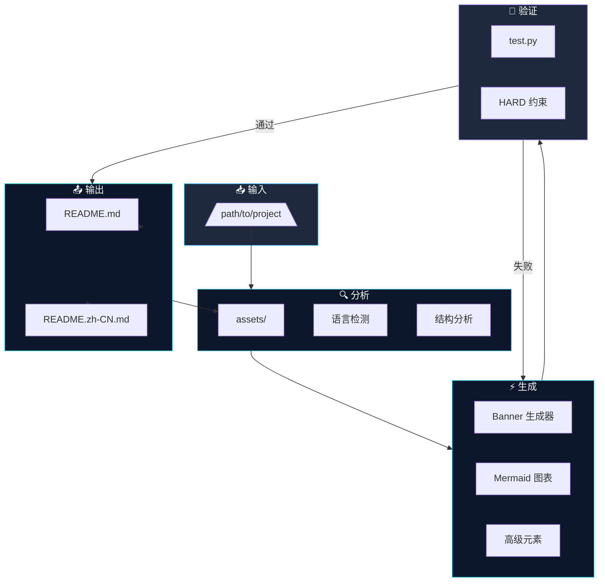
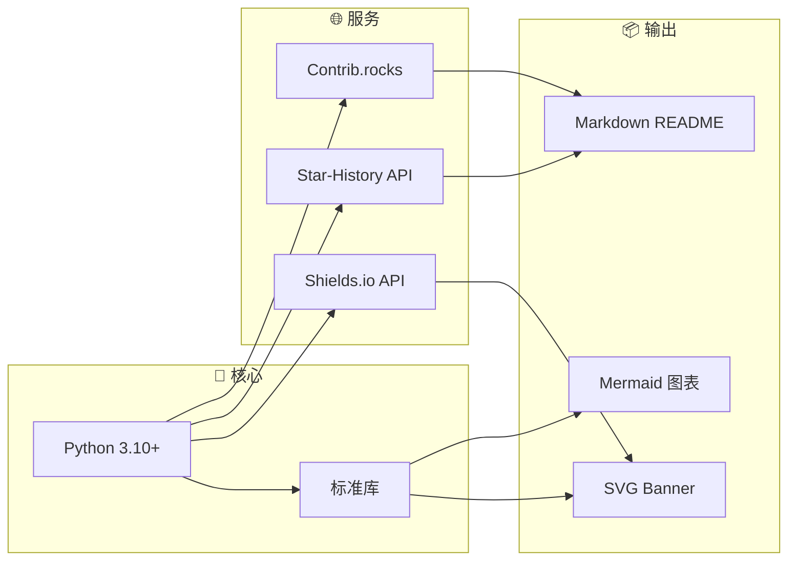

# 🎨 GitHub README Crafter

<p align="center">
  <a href="https://github.com/AlanSong2077/github-readme-crafter-Skill">
    
  </a>
</p>

<p align="center">
  <a href="https://github.com/AlanSong2077/github-readme-crafter-Skill/stargazers">
    
  </a>
  <a href="https://github.com/AlanSong2077/github-readme-crafter-Skill/forks">
    
  </a>
  
  
</p>

<p align="center">
  
  
  
  
</p>

<p align="center">
  <a href="https://github.com/AlanSong2077/github-readme-crafter-Skill/releases/latest">
    
  </a>
  
  
</p>

<div align="center">

### [English](README.md) | 中文

</div>

---

## ✨ 这是什么?

<p align="center">
  <em>"每个 README 都是第一印象。让你的令人难忘。"</em>
</p>

`github-readme-crafter` 使用 **规范驱动开发 (SDD)** 和 **Harness Engineering** 将普通项目文档转化为**高端、引人注目**的 README 文档。

| 指标 | 数值 |
|------|------|
| 📦 脚本 | 5 个核心生成器 |
| 📋 章节 | 14 个高端章节 |
| ✅ 验证 | 7 大测试类别 |
| 🌐 语言 | EN + 中文 |
| 🎨 风格 | 2 种高端层级 |

---

## 🚀 快速开始

```bash
# 一行命令搞定
git clone https://github.com/AlanSong2077/github-readme-crafter-Skill.git \
  && cd github-readme-crafter-Skill \
  && python3 scripts/create_readme.py /path/to/project --style professional
```

```bash
# 完整验证（交付前必须执行）
python3 test.py /path/to/project
```

**要求**: Python 3.10+

---

## ⚡ 特性

| | 特性 | 描述 |
|---|------|------|
| 🎨 | **动态 Banner** | SVG 渐变 + 几何装饰，深色/浅色模式 |
| 📊 | **Mermaid 图表** | 技术栈、架构、工作流 — 自动生成 |
| 🌓 | **主题适配** | 自动深色/浅色模式切换 |
| ⚡ | **TL;DR 区块** | 一命令快速开始 |
| 📈 | **Star 历史** | 交互式项目增长可视化 |
| 🧪 | **强验证** | 7 类别 HARD 约束，零容忍 |
| 🌐 | **双语支持** | 英文 + 中文，结构完全一致 |
| 🔒 | **规范优先** | 规范驱动，不允许偏差 |

---

## 🔬 架构



---

## 📐 技术栈



---

## 📂 项目结构

```
github-readme-crafter-Skill/
├── SPEC.md                    # 📜 规范（真实性来源）
├── Agent.md                  # 🤖 Agent 指令
├── test.md                   # 🧪 测试定义
├── test.py                   # ⚡ 可执行验证器
│
├── scripts/
│   ├── create_readme.py      # 🚀 主生成器
│   ├── analyze_project.py     # 🔍 项目分析器
│   ├── generate_banner.py    # 🎨 Banner 生成器
│   ├── generate_mermaid.py   # 📊 图表生成器
│   └── generate_advanced_elements.py  # ✨ 徽章等
│
└── references/
    ├── templates.md           # 📋 README 模板
    ├── top_projects_analysis.md  # 🏆 顶级仓库分析
    └── mermaid_examples.md    # 📈 图表示例
```

---

## 🎯 风格层级

| 层级 | 描述 | 适用场景 |
|------|------|----------|
| `standard` | 全部 14 个高端章节 | 中型项目 |
| `professional` | 扩展 + 赞助商、安全 | 大型框架 |

**两种风格都产出博物馆级文档。**

---

## 🧪 验证流水线

每个输出必须通过 **全部 7 类别**：

| 类别 | 检查项 | 执行方式 |
|------|--------|----------|
| **A** | 文件存在、SVG 有效性、尺寸 | HARD FAIL |
| **B** | TL;DR 必须有、章节完整 | HARD FAIL |
| **C** | ≤5 徽章、flat-square、无 emoji | HARD FAIL |
| **D** | URL 可访问 (HTTP 200) | HARD FAIL |
| **E** | 有效 Mermaid、≤15 节点 | HARD FAIL |
| **F** | 双语一致性、中文内容 | HARD FAIL |

```bash
# 验证你的 README
python3 test.py /path/to/project

# 退出码 0 = 通过, 退出码 1 = 失败
```

---

## 📊 项目统计

| 统计 | 徽章 |
|------|-------|
| Stars |  |
| Forks |  |
| Size |  |

---

## 📈 Star 历史

[](https://www.star-history.com/#AlanSong2077/github-readme-crafter-Skill&type=Date)

---

## 👥 贡献者

<a href="https://github.com/AlanSong2077/github-readme-crafter-Skill/graphs/contributors">
  
</a>

---

## 🔗 分享

<a href="https://github.com/AlanSong2077/github-readme-crafter-Skill">
  
</a>
<a href="https://reddit.com/submit?url=https://github.com/AlanSong2077/github-readme-crafter-Skill&title=GitHub%20README%20Crafter%20-%20Spec-Driven%20AI%20Documentation">
  
</a>
<a href="https://twitter.com/intent/tweet?url=https://github.com/AlanSong2077/github-readme-crafter-Skill&text=GitHub%20README%20Crafter%20-%20Spec-Driven%20AI%20Documentation%20Generator">
  
</a>
<a href="https://news.ycombinator.com/submitlink?u=https://github.com/AlanSong2077/github-readme-crafter-Skill">
  
</a>

---

## 🤝 贡献

我们遵循 **规范驱动开发**：

1. 阅读 `SPEC.md` — 真实性来源
2. 进行更改
3. 如需更新 `test.py`
4. 运行 `python3 test.py` 验证
5. 提交 PR

---

## 📜 许可证

MIT 许可证

---

<p align="center">
  
  
</p>

<p align="center">
  <a href="https://github.com/AlanSong2077">@AlanSong2077</a> • 2026
</p>
