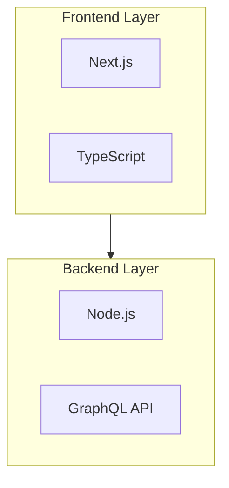

# GitHub README Crafter

Create professional README documents that match the quality of top-tier open-source projects like Microsoft Terminal, Vercel Next.js, OpenClaw, and Facebook React.

## Capabilities

- **Project Analysis**: Automatically detects language, framework, and structure
- **Dynamic Banner Generation**: Creates SVG banners with gradient backgrounds and geometric decorations
- **Architecture Diagrams**: Generates Mermaid diagrams (system architecture, tech stack, workflow)
- **Bilingual Support**: Produces both English and Chinese versions with proper technical terminology
- **Professional Layout**: Uses Shields.io badges, proper heading hierarchy, clean SVG icons (not emoji)
- **Advanced Elements**: Star history charts, contributor images, social badges, roadmap sections, sponsors showcase
- **Dark/Light Mode**: Supports theme-aware logo and asset switching
- **TL;DR Sections**: Quick start blocks for busy readers

## When to Use

Trigger this skill when users:
- Ask to "create a README", "generate project docs", or "write GitHub documentation"
- Mention "architecture diagram", "system design", or "tech stack visualization"
- Request bilingual documentation (中英双语README)
- Need to improve existing README quality to match top open-source projects
- Want "professional README", "beautiful docs", or "GitHub profile readme"
- Need "star history", "contributors showcase", or "sponsors section"

## Workflow

```
1. Analyze project structure → Extract metadata
2. Generate visual assets → Banner + diagrams
3. Compose sections → Features, installation, usage
4. Add advanced elements → Contributors, roadmap, social links, sponsors
5. Add TL;DR section → Quick start for fast readers
6. (Optional) Create Chinese version
7. Write to project directory
```

## Quick Start

### One-Command Generation

```bash
# Basic usage - generates README.md with banner and diagrams
python3 scripts/create_readme.py /path/to/project

# Full features with bilingual support
python3 scripts/create_readme.py /path/to/project --bilingual --style professional
```

### Manual Component Generation

**Analyze project:**
```bash
python3 scripts/analyze_project.py /path/to/project
```

**Generate banner:**
```bash
python3 scripts/generate_banner.py "ProjectName" \
    --subtitle "Brief description" \
    --output assets/banner.svg
```

**Create architecture diagram:**
```bash
python3 scripts/generate_mermaid.py techstack \
    --project /path/to/project \
    --output diagram.md
```

**Add advanced elements:**
```bash
# Social badges
python3 scripts/generate_advanced_elements.py social

# Star history chart
python3 scripts/generate_advanced_elements.py star-history \
    --repo-owner username \
    --repo-name projectname

# Contributors section
python3 scripts/generate_advanced_elements.py contributors \
    --repo-owner username \
    --repo-name projectname

# Sponsors showcase
python3 scripts/generate_advanced_elements.py sponsors

# Share buttons
python3 scripts/generate_advanced_elements.py share
```

## Output Structure

After running, the project directory will have:

```
project/
├── README.md                    # Main README (English)
├── README.zh-CN.md             # Chinese version (if --bilingual)
├── assets/
│   ├── banner.svg             # Generated banner
│   ├── logo-light.svg          # Light mode logo (optional)
│   └── logo-dark.svg          # Dark mode logo (optional)
└── (existing project files)
```

## Design Patterns (From Top Projects - 2026 Updated)

### OpenClaw Style (Modern)
- Dark/Light mode logo switching with `<picture>` tag
- `style=for-the-badge` for modern badge appearance
- Star History chart integration
- Sponsors table with logo display
- TL;DR quick start section
- Development channels explanation
- Security section for messaging apps

### Microsoft Terminal Style
- Clean header with logo + title + description
- 3-4 focused badges (build, version, platform)
- Extensive screenshots/GIFs for visual demonstration
- Dark color scheme with subtle gradients

### Vercel Next.js Style
- Large text title (no banner image)
- Social proof: "Used by some of the world's largest companies"
- One-line installation commands
- Multiple code examples with copy-paste ready snippets
- Sponsor/supporter acknowledgments

### Facebook React Style
- Essential badges only (npm version, build status, license)
- 3-4 key features in bullet points
- Clear documentation links
- Code of conduct and contributing guidelines
- Minimal visual noise

### Rust Language Style
- Official brand colors (Rust Orange #CE422B)
- Multi-platform build status matrix
- Detailed contribution guide
- Brand artwork page reference

### codecrafters Build Your Own X Style
- Philosophy quote introduction
- Collapsible table of contents with anchor links
- Language-tagged resource lists

### kamranahmedse Developer Roadmap Style
- Share buttons for social media
- Flat style badges with dark mode support
- Decorative separator images
- Contributors showcase with contrib.rocks

## Modern Badge Styling

### For-The-Badge Style (2026 Standard)
```markdown
[]()
[]()
[]()
```

### Dark Mode Compatible Badges
```markdown
[]()
```

### Social Badges
```markdown
[](link)
[](link)
```

## Dark/Light Mode Support

### Logo Switching
```html
<picture>
  <source media="(prefers-color-scheme: light)" srcset="./assets/logo-light.svg">
  
</picture>
```

### Banner Example
```html
<p align="center">
  <picture>
    <source media="(prefers-color-scheme: light)" srcset="banner-light.svg">
    
  </picture>
</p>
```

## TL;DR Section

Add a quick reference section for busy readers:

```markdown
## Quick Start (TL;DR)

**Full guide**: [Getting Started](docs/getting-started.md)

```bash
# Install
npm install project-name

# Quick start
project-name init
```

**Requirements**: Node 18+, npm 8+
```

## Star History Chart

```markdown
## Star History

[](https://www.star-history.com/#owner/repo&type=Date)
```

## Sponsors Showcase

### Table Layout (for many sponsors)
```html
## Sponsors

<table>
  <tr>
    <td align="center" width="16.66%">
      <a href="https://sponsor.com/">
        <picture>
          <source media="(prefers-color-scheme: light)" srcset="sponsor-light.svg">
          
        </picture>
      </a>
    </td>
  </tr>
</table>
```

### Badge Layout (for few sponsors)
```markdown
## Sponsors

[](https://openai.com)
[](https://github.com)
```

## Share Buttons

```markdown
## Share

[](url)
[](url)
[](url)
```

## Contributors Section

```markdown
## Contributors

<a href="https://github.com/owner/repo/graphs/contributors">
  
</a>
```

## Development Channels

```markdown
## Development Channels

- **stable**: Tagged releases (`v1.0.0`), npm dist-tag `latest`
- **beta**: Pre-release tags (`v1.0.0-beta.1`), npm dist-tag `beta`
- **dev**: Latest development version, npm dist-tag `dev`

Switch channels: `npm install project@stable|beta|dev`
```

## Content Structure

**Minimal** (small library):
1. Title + Badges
2. One-line description
3. Installation command
4. Basic usage example
5. License

**Standard** (medium project):
1. Banner + Title + Badges
2. TL;DR Quick Start
3. Features (3-5 bullets)
4. Installation commands
5. Usage examples
6. Architecture diagram (Mermaid)
7. Contributing guidelines
8. License

**Professional** (large project):
1. Banner (dark/light mode) + Title + Badges
2. Sponsors showcase
3. TL;DR Quick Start
4. Overview paragraph
5. Features (3-5 bullets)
6. Installation (multiple methods)
7. Quick Start example
8. Tech Stack diagram (Mermaid)
9. Architecture diagram (Mermaid)
10. Star History chart
11. Contributors showcase
12. Development guide
13. Security policy
14. Contributing guidelines
15. Share buttons
16. License

## Customization

### Banner Colors

Modify `scripts/generate_banner.py` color schemes:

```python
# Dark theme (default)
primary_color = "#1a1a2e"      # Deep blue
secondary_color = "#16213e"    # Darker blue
accent_color = "#e94560"       # Coral red

# Alternative schemes
schemes = {
    'rust': ('#CE422B', '#8B2F1A', '#FFD700'),    # Rust Orange
    'vercel': ('#000000', '#333333', '#FFFFFF'),   # Black/White
    'green': ('#2D5A27', '#1E3D1A', '#4CAF50'),    # Forest
    'openclaw': ('#1a1a2e', '#16213e', '#e94560'), # Modern dark
}
```

### Badge Customization

Edit `get_shield_badges()` in `scripts/create_readme.py`:

```python
# Essential badges (for-the-badge style)
badges.append(f"")
badges.append(f"")
badges.append(f"")

# Optional badges
badges.append(f"")
badges.append(f"")
```

### Diagram Types

See [references/mermaid_examples.md](references/mermaid_examples.md) for:
- System architecture diagrams
- Tech stack hierarchies
- Workflow/CI pipelines
- Module dependency graphs
- Git branching strategies

## Best Practices

### Visual Design
- **Use gradients** for banners, not flat colors
- **Keep badges to 3-5 maximum** (avoid badge bloat)
- **Use `style=for-the-badge`** for modern badge appearance
- **Use Mermaid** for diagrams (renders natively on GitHub)
- **Avoid emoji overuse**; prefer SVG icons via shields.io
- **Use geometric decorations** (circles, rectangles) in banners
- **Support dark/light mode** with `<picture>` element

### Content Structure
```
1. Header: Banner/Logo + Title + Description
2. Badges: Build status, Version, License (3-5 max, for-the-badge style)
3. TL;DR: Quick start for busy readers
4. Overview: One paragraph summary
5. Features: 3-5 key benefits (bullet points)
6. Installation: Copy-paste ready commands
7. Quick Start: Minimal working example
8. Documentation: Links to full docs
9. Architecture: Diagrams (Mermaid)
10. Star History: Growth chart
11. Contributors: Contributor showcase
12. Sponsors: Sponsor logos (if applicable)
13. Contributing: Guidelines + Code of Conduct
14. Share: Social sharing buttons
15. License: Full license or reference
```

### Technical Writing
- Use **imperative mood** for installation steps: "Install the package"
- Provide **complete, runnable** code examples
- Keep paragraphs to **2-4 sentences**
- Use **consistent terminology** throughout
- Include **error handling** in code examples
- Add **TL;DR section** for quick readers

### Language Switching

For bilingual READMEs, add this at the top of translated versions:

```markdown
<div align="right">

[English](README.md) | [中文](README.zh-CN.md) | [日本語](README.ja-JP.md)

</div>
```

## Templates

Three built-in styles:

| Style | Use Case | Sections |
|-------|----------|----------|
| `minimal` | Small libraries | Title, badges, install, usage, license |
| `standard` | Medium projects | Banner, badges, TL;DR, features, diagrams, structure |
| `detailed` | Large frameworks | All sections + sponsors, star history, share buttons, security |

See [references/templates.md](references/templates.md) for full template code.

## Example Output

The generated README follows patterns from top projects:

### Modern Banner Example (with dark/light mode)
```html
<picture>
  <source media="(prefers-color-scheme: light)" srcset="./assets/banner-light.svg">
  
</picture>
```

### Modern Badge Example (for-the-badge)
```markdown
[]()
[]()
[]()
```

### Tech Stack Diagram Example


### Star History Example
```markdown
[](https://www.star-history.com/#owner/repo&type=Date)
```

## Advanced Features

### Star History Chart
```bash
python3 scripts/generate_advanced_elements.py star-history \
    --repo-owner microsoft \
    --repo-name terminal
```

### Contributors Section
```bash
python3 scripts/generate_advanced_elements.py contributors \
    --repo-owner facebook \
    --repo-name react
```

### Sponsors Showcase
```bash
python3 scripts/generate_advanced_elements.py sponsors
```

### Share Buttons
```bash
python3 scripts/generate_advanced_elements.py share
```

### Roadmap Generation
```bash
python3 scripts/generate_advanced_elements.py roadmap
```

## Resources

- [references/templates.md](references/templates.md) - Ready-to-use templates
- [references/mermaid_examples.md](references/mermaid_examples.md) - Mermaid diagram patterns
- [references/top_projects_analysis.md](references/top_projects_analysis.md) - Analysis of Microsoft, Vercel, Meta, OpenClaw, codecrafters, developer-roadmap projects
