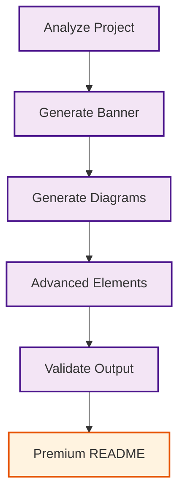

```mermaid
flowchart TB
    %% How It Works

    classDef client fill:#e1f5fe,stroke:#01579b,stroke-width:2px
    classDef service fill:#f3e5f5,stroke:#4a148c,stroke-width:2px
    classDef database fill:#e8f5e9,stroke:#1b5e20,stroke-width:2px
    classDef external fill:#fff3e0,stroke:#e65100,stroke-width:2px
    analyze[Analyze Project]
    class analyze service
    banner[Generate Banner]
    class banner service
    mermaid[Generate Diagrams]
    class mermaid service
    advanced[Advanced Elements]
    class advanced service
    validate[Validate Output]
    class validate service
    output[Premium README]
    class output external
    analyze --> banner
    banner --> mermaid
    mermaid --> advanced
    advanced --> validate
    validate --> output
```