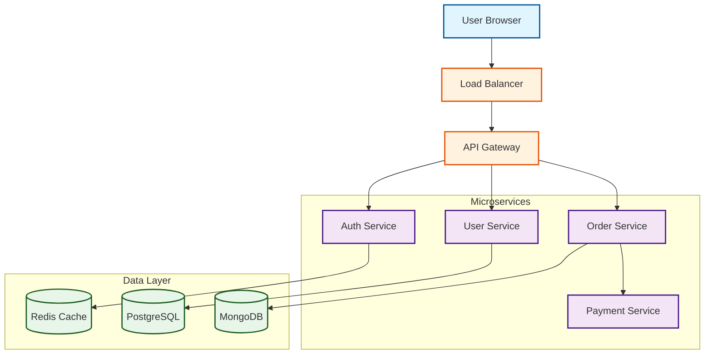
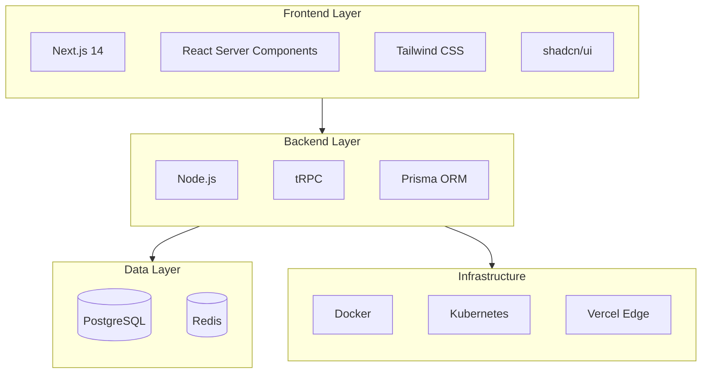
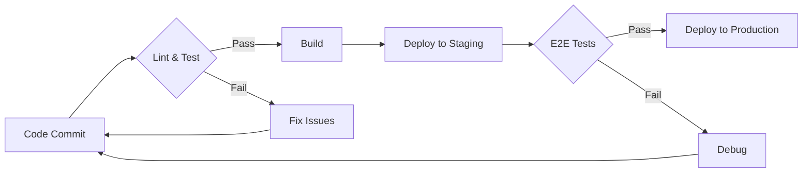
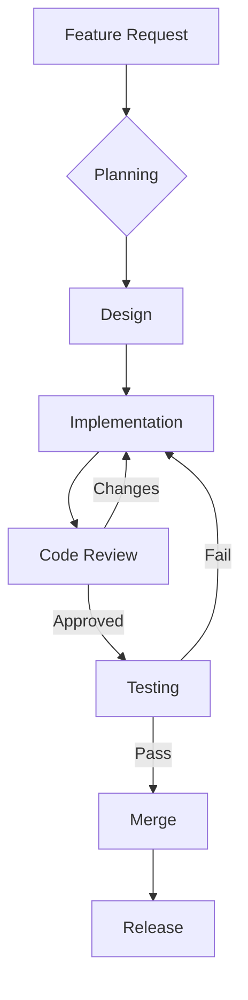
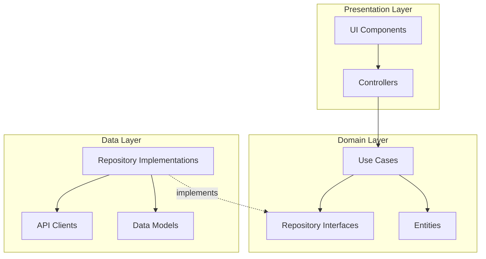
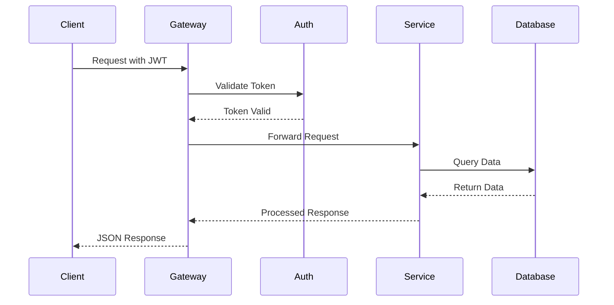
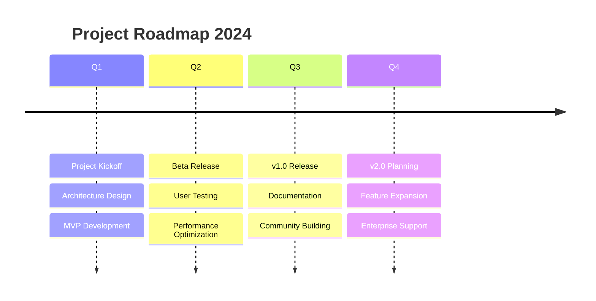
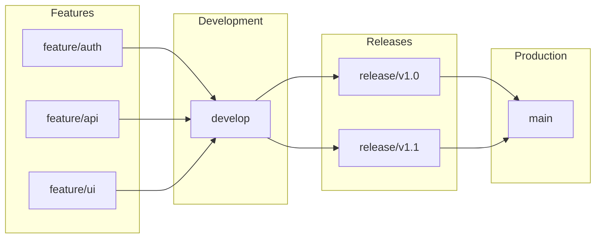

# Mermaid 图表示例

## 系统架构图

### 微服务架构

## 技术栈层次图

### Full-Stack Web App

## 工作流程图

### CI/CD Pipeline

### 开发流程

## 模块依赖图

### Clean Architecture

## 时序图

### API Request Flow

## 时间线图

### Project Roadmap

## Git 分支策略

## 颜色规范

建议的颜色方案（使用classDef）：

| 类型 | 背景色 | 边框色 | 用途 |
|------|--------|--------|------|
| Client | #e1f5fe | #01579b | 客户端/浏览器 |
| Service | #f3e5f5 | #4a148c | 服务端 |
| Database | #e8f5e9 | #1b5e20 | 数据库 |
| External | #fff3e0 | #e65100 | 外部服务 |
| Queue | #fce4ec | #880e4f | 消息队列 |
| Cache | #f1f8e9 | #33691e | 缓存层 |
