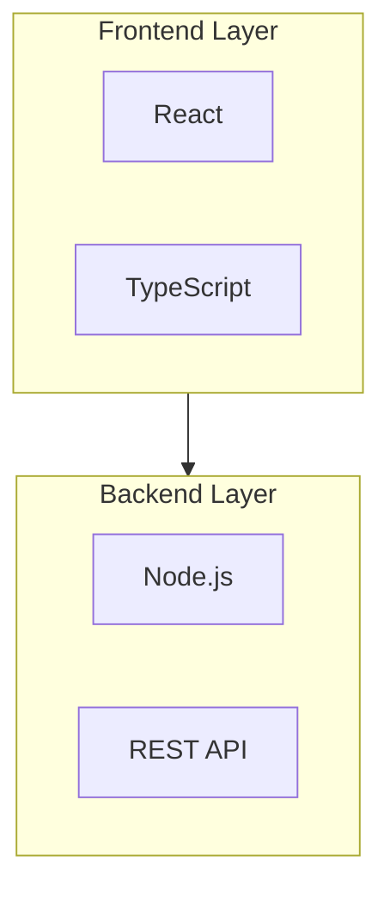
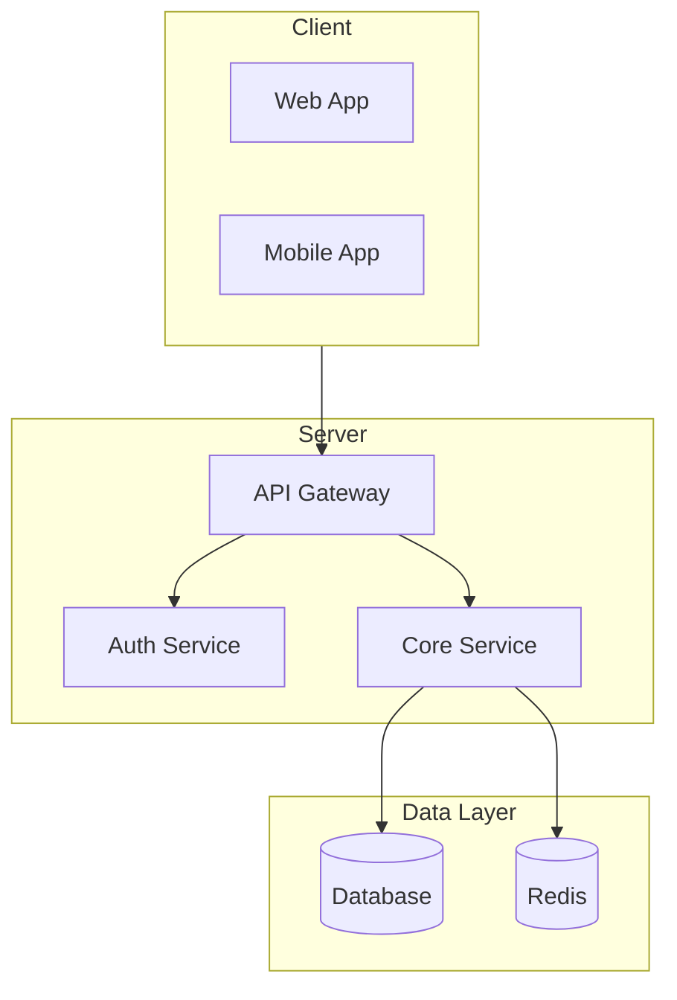
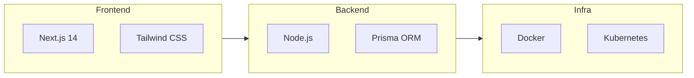

# README 模板参考

## 模板类型

### Minimal
适用于小型工具库或简单项目

```markdown
# ProjectName

[]()
[]()

Brief description of what this project does.

## Installation

```bash
pip install projectname
```

## Usage

```python
import projectname
projectname.run()
```

## License

MIT
```

### Standard
适用于中等规模的开源项目

```markdown
<div align="center">
  <picture>
    <source media="(prefers-color-scheme: light)" srcset="./assets/banner-light.svg">
    
  </picture>

  []()
  []()
  []()
</div>

## Quick Start (TL;DR)

```bash
npm install projectname
projectname init
```

**Requirements**: Node 18+

For full documentation, see [Getting Started](docs/getting-started.md).

## Overview

Comprehensive project description explaining what it does and why it's useful.

## Features

- Feature one with clear benefit
- Feature two with technical advantage
- Feature three with performance highlight

## Installation

### Using npm

```bash
npm install projectname
```

## Quick Start

```typescript
import { ProjectName } from 'projectname';

const app = new ProjectName();
await app.initialize();
```

## Tech Stack



## Contributing

See [CONTRIBUTING.md](CONTRIBUTING.md)

## License

[MIT](LICENSE)
```

### Professional
适用于大型框架或企业级项目

```markdown
<!-- Professional README Template -->

<div align="center">
  <picture>
    <source media="(prefers-color-scheme: light)" srcset="./assets/banner-light.svg">
    
  </picture>

  []()
  []()
  [](link)
  []()
</div>

## Sponsors

<table>
  <tr>
    <td align="center" width="20%">
      <a href="https://sponsor1.com/">
        <picture>
          <source media="(prefers-color-scheme: light)" srcset="./assets/sponsors/sponsor1-light.svg">
          
        </picture>
      </a>
    </td>
    <td align="center" width="20%">
      <a href="https://sponsor2.com/">
        <picture>
          <source media="(prefers-color-scheme: light)" srcset="./assets/sponsors/sponsor2-light.svg">
          
        </picture>
      </a>
    </td>
  </tr>
</table>

## Quick Start (TL;DR)

**Full guide**: [Getting Started](docs/getting-started.md)

```bash
# Install
npm install projectname

# Initialize
projectname init

# Run
projectname start
```

**Requirements**: Node 20+, npm 9+

## Overview

A comprehensive paragraph describing the project, its main value proposition, and what makes it unique. Explain who it's for and why they should use it.

## Features

- **Feature One**: Detailed description of the first key feature and its benefits
- **Feature Two**: Technical advantage or unique capability
- **Feature Three**: Performance highlight or integration benefit
- **Feature Four**: Community or ecosystem advantage

## Installation

### npm

```bash
npm install projectname
```

### pnpm

```bash
pnpm add projectname
```

### Docker

```bash
docker pull owner/projectname:latest
docker run -p 3000:3000 owner/projectname
```

## Quick Start

```typescript
import { ProjectName } from 'projectname';

// Initialize
const app = new ProjectName({
  config: './config.yaml'
});

await app.start();
```

## Architecture



## Tech Stack



## Star History

[](https://www.star-history.com/#owner/repo&type=Date)

## Development

### Prerequisites

- Node.js 20+
- npm 9+ or pnpm 8+
- Docker (for containerized development)

### Setup

```bash
git clone https://github.com/owner/repo.git
cd repo
npm install
cp .env.example .env
npm run dev
```

### Testing

```bash
npm test
npm run test:watch
npm run test:coverage
```

## Contributing

We welcome contributions! Please see [CONTRIBUTING.md](CONTRIBUTING.md) for guidelines.

### Development Channels

- **stable**: Production-ready releases
- **beta**: Pre-release features for testing
- **dev**: Latest development version

## Security

For security issues, please see [SECURITY.md](SECURITY.md).

## Share

[](url)
[](url)
[](url)

## Contributors

<a href="https://github.com/owner/repo/graphs/contributors">
  
</a>

## License

[MIT](LICENSE) - See [LICENSE](LICENSE) for details.
```

## 视觉元素指南

### 徽章（Shields.io）

**基础格式**：
```
https://img.shields.io/badge/<LABEL>-<MESSAGE>-<COLOR>?style=for-the-badge
```

**2026 推荐样式 (for-the-badge)**：
```markdown
[]()
[]()
[]()
```

**暗色模式徽章**：
```markdown
[]()
```

**社交徽章**：
```markdown
[](link)
[](link)
```

### 布局元素

**居中容器**：
```html
<div align="center">
  <!-- centered content -->
</div>
```

**暗色/亮色模式图片切换**：
```html
<picture>
  <source media="(prefers-color-scheme: light)" srcset="./assets/logo-light.svg">
  
</picture>
```

**折叠区块**：
```html
<details>
<summary>Click to expand</summary>

Content here

</details>
```

### 分隔符

**视觉分隔**：
```markdown
---
```

**装饰性图片分隔**：
```markdown

```

**SVG 风格分隔**：
```markdown
<p align="center">
  
</p>
```

## 技术写作风格

### 标题层级
1. H1: 项目名称（仅一个）
2. H2: 主要章节
3. H3: 子章节

### TL;DR 区块
对于大型项目，在顶部添加快速开始区块：
```markdown
## Quick Start (TL;DR)

**Full guide**: [Getting Started](docs/guide.md)

```bash
npm install project
project init
```

**Requirements**: Node 18+
```

### 段落原则
- 每段不超过3-4句
- 技术术语保持一致
- 代码示例紧跟说明

### 代码块
- 指定语言以获得语法高亮
- 包含注释解释关键行
- 提供完整的可运行示例

### 开发频道说明
```markdown
## Development Channels

- **stable**: 正式发布版 (`npm install project@latest`)
- **beta**: 预发布版 (`npm install project@beta`)
- **dev**: 开发版 (`npm install project@dev`)
```
