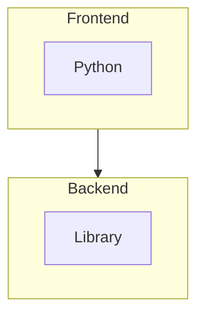
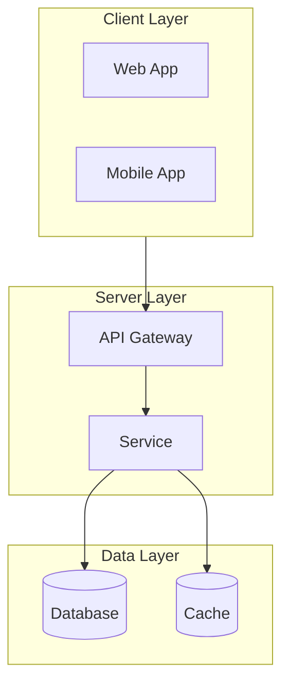

# README 模板参考

> **Premium Only** — There is no minimal mode. All READMEs are visually impressive.

## 模板类型

### Standard (Premium Minimum)
适用于所有项目 — 包含所有必需章节

```markdown
<div align="center">


### [English](README.md) | [中文](README.zh-CN.md)

</div>

<p align="center">
  <!-- Badges (max 5) -->
  
  
</p>

## Overview

Project description explaining value proposition.

## Features

- Feature one with clear benefit
- Feature two with technical advantage
- Feature three with performance highlight

## Quick Start (TL;DR)

```bash
pip install projectname
projectname init
```

**Requirements**: Python 3.10+

## Installation

```bash
pip install projectname
```

## Usage

```python
import projectname
projectname.run()
```

## Tech Stack



## Star History

[](https://www.star-history.com/#owner/repo&type=Date)

## Contributors

<a href="https://github.com/owner/repo/graphs/contributors">
  
</a>

## Share

[](url)
[](url)
[](url)

## Contributing

See [CONTRIBUTING.md](CONTRIBUTING.md)

## License

MIT
```

### Professional (Extended)
适用于大型框架或企业级项目

```markdown
<!-- Standard sections PLUS: -->

## Sponsors

<table>
  <tr>
    <td align="center">
      <a href="https://sponsor.com/">
        
      </a>
    </td>
  </tr>
</table>

## Architecture



## Development Channels

- **stable**: Production releases
- **beta**: Pre-release testing
- **dev**: Latest development

## Security

See [SECURITY.md](SECURITY.md)
```

---

## 视觉元素指南

### 徽章（Shields.io）

**flat-square 样式（默认）**：
```markdown


```

### 布局元素

**Banner with Dark/Light Mode**：
```html
<picture>
  <source media="(prefers-color-scheme: light)" srcset="./assets/banner-light.svg">
  
</picture>
```

**Language Switcher**：
```markdown
### [English](README.md) | [中文](README.zh-CN.md)
```

---

## 内容结构

### 必需章节（所有 README）

1. Banner (gradient + decorations)
2. Language Switcher
3. Badges (max 5, flat-square)
4. TL;DR Quick Start
5. Overview
6. Features (3-5 bullets)
7. Installation
8. Usage
9. Tech Stack (Mermaid)
10. Star History
11. Contributors
12. Share Buttons
13. Contributing
14. License

### 可选章节（Professional）

- Sponsors
- Architecture (extended)
- Development Channels
- Security

---

## 技术写作风格

### 标题层级
- H1: 项目名称（仅一个）
- H2: 主要章节
- H3: 子章节

### TL;DR 区块
```markdown
## Quick Start (TL;DR)

```bash
pip install project
project init
```

**Requirements**: Python 3.10+
```

### 代码块
- 指定语言以获得语法高亮
- 包含注释解释关键行
- 提供完整的可运行示例

---

**END OF TEMPLATES.md**
